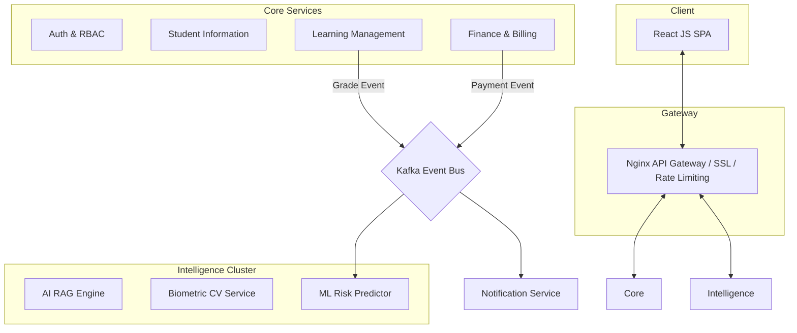

<div align="center">

# 🎓 Project Nexus
### The Unified Intelligent Campus Platform

**Final Year Design Project (FYDP) - BS Information Technology**  
**Project ID:** `FYDP-BSIT-2504`

> **Status: 100% COMPLETED** - All development, integration, and testing phases are finished.

[](backend/services)
[](frontend/README.md)
[](backend/services/ai-service)
[](backend/services/attendance-service)
[](docker-compose.yml)

</div>

---

## 📚 Table of Contents
1.  [Overview](#-overview)
2.  [Core Innovation: The Intelligence Flywheel](#-core-innovation)
3.  [The Polyglot Architecture](#-architecture)
4.  [Microservices Directory](#-microservices)
5.  [Role-Based Features](#-key-features)
6.  [Advanced Tech Stack](#-technology-stack)
7.  [Setup & Deployment](#-quick-start)
8.  [Development Team](#-project-team)

---

## 🌍 Overview

**Project Nexus** is a revolutionary university ecosystem built to dismantle the traditional "Data Silo" problem in higher education. Conventional institutions separate student records (SIS) from learning management (LMS) and financial tracking. **Nexus unifies these 14 distinct domains into a single, high-performance polyglot microservices platform.**

By combining **Computer Vision**, **Generative AI**, and **Event-Driven Orchestration**, Nexus transforms the university from a passive record-keeper into an active, intelligent partner in student success.

---

## 🌟 Core Innovation: The Intelligence Flywheel

The defining feature of Project Nexus is its **Integrated Intelligence Layer**. Unlike modular campus systems, Nexus creates a data loop where every event informs a higher-level insight:

*   **Biometric Input**: CV-based attendance and geofencing verify physical presence.
*   **Predictive Analytics**: Scikit-learn models process attendance and LMS grades to identify "At-Risk" students in real-time.
*   **Proactive AI**: A **Hybrid CAG+RAG Assistant** (Google Gemini) monitors these alerts and proactively offers study plans, tutoring, and financial guidance based on the student's unique data.

---

## 🏗️ Architecture

Nexus is built on a **Resilient Event-Driven Backbone** using **Apache Kafka**, ensuring that critical data (like grades and fees) is never lost, even if a specific service is temporarily offline.



---

## 📦 Microservices

The platform consists of **14 independent microservices**, each with its own database and specialized logic:

| Service | Responsibility | Database |
|:---|:---|:---|
| **Auth** | Unified Identity & Permission Mapping (RBAC) | PostgreSQL |
| **SIS** | Departmental Hierarchy & Permanent Transcripts | PostgreSQL |
| **LMS** | Classroom, Course Content, Quizzes & Assignments | PostgreSQL |
| **AI Assistant** | Degree-aware RAG Assistant (Jack of all trades) | ChromaDB + Redis |
| **Attendance** | Multi-factor Biometrics (Liveness + GPS) | ChromaDB |
| **Finance** | Automated Invoicing, Fines & Stripe Integration | PostgreSQL |
| **Analytics** | Student Performance Prediction (Scikit-learn) | MongoDB |
| **Chat** | Real-time P2P & Group Messaging | MongoDB |
| **Operations** | Smart Grievances (NLP) & Announcements | MongoDB |
| **HR** | Staff Management & Automated Leave Workflows | PostgreSQL |
| **Library** | Digital Catalog & Automated Fine Linkage | PostgreSQL |
| **Scheduler** | Conflict-free Automated Timetabling | PostgreSQL |
| **Notification** | Real-time WebSocket Push & Notifications | MongoDB + Redis |
| **AI Support** | Technical Helpdesk & Documentation RAG | ChromaDB |

---

## ✨ Key Features

### 🎓 Student Experience
- **Multi-Factor Check-In**: Smart attendance requiring GPS verification + Blink/Smile liveness checks.
- **Academic AI Buddy**: Chatbot that knows your specific degree (BBA, Law, IT) and warns you about low marks.
- **Financial Freedom**: Real-time fee ledger with secure credit card and digital wallet support.
- **Unified Portal**: One login for transcripts, assignments, chat, and campus grievances.

### 👨‍🏫 Faculty Empowerment
- **Auto-Grading & Quizzing**: Server-side timed quizzes with instant grading and transcript sync.
- **Success Dashboard**: Visualize student attendance trends and academic engagement charts.
- **Resource Management**: Seamless drag-and-drop course material organization.

### 👔 Institutional Governance
- **Executive KPI Center**: High-level revenue tracking, enrollment growth, and campus health metrics.
- **Automated Ledger**: Cross-service fine calculation (Library → Finance) and automated scholarship application.
- **Audit Transparency**: Immutable system logs tracking every administrative action.

---

## 🛠️ Technology Stack

### The Frontend (User Interface)
- **Framework**: React 19 (Concurrent Mode)
- **Build Engine**: Vite (Ultra-fast HMR)
- **UI System**: Material UI 7 (Custom Design Tokens)
- **Visuals**: Recharts (Analytics) & Framer Motion (Animations)

### The Backend (Computation)
- **Engine**: FastAPI (High-performance ASGI)
- **Intelligence**: Google Gemini (LLM), OpenCV (Vision), Dlib (Biometrics).
- **Automation**: Apache Kafka (Message Broker), Redis (Caching/Streaming).

### The Data Layer (Polyglot Persistence)
- **Relational**: PostgreSQL (Transactional Integrity)
- **NoSQL**: MongoDB (Flexible Document Content)
- **Vector**: ChromaDB (AI Semantic Memory)
- **Caching**: Redis (Session & Configuration)

---

## 🚀 Quick Start

### Docker Environment 🐳
The entire 14-service stack is pre-configured for Docker. Ensure you have 16GB RAM for the full cluster.

```bash
# Clone the project
git clone https://github.com/ASAD2204/PROJECT_NEXUS.git
cd PROJECT_NEXUS

# Deploy the stack
docker-compose up -d --build
```

### Access Points
- **Web Portal**: `http://localhost:80`
- **System Metrics**: `http://localhost:9090` (Prometheus)
- **Dashboards**: `http://localhost:3000` (Grafana)

---

## 👥 Project Team

| Name | Roll Number | Role | GitHub |
|:---|:---|:---|:---|
| **Muhammad Asad** | BIT22031 | Project Lead & Backend Architect | [@ASAD2204](https://github.com/ASAD2204) |
| **Muhammad Saad** | BIT22034 | Frontend Lead & AI Engineer | [@saadi-js](https://github.com/saadi-js) |
| **Muhammad Hanzla** | BIT22002 | QA Lead & UI/UX Specialist | [@Hanzla56-H](https://github.com/Hanzla56-H) |

**Supervisor**: Dr. Ghulam Mustafa  
**Department**: Information Technology, University of the Punjab, Gujranwala Campus

---

## 📜 Institution & License

**© 2025-2026 Department of Information Technology, University of the Punjab, Gujranwala Campus**

This repository contains the Final Year Design Project (FYDP). This is a proprietary academic deliverable. Unauthorized copying or redistribution is strictly prohibited. Access is granted for institutional evaluation and defense purposes only.

<div align="center">

**Built with ❤️ for a Smarter Digital Campus**

</div>
