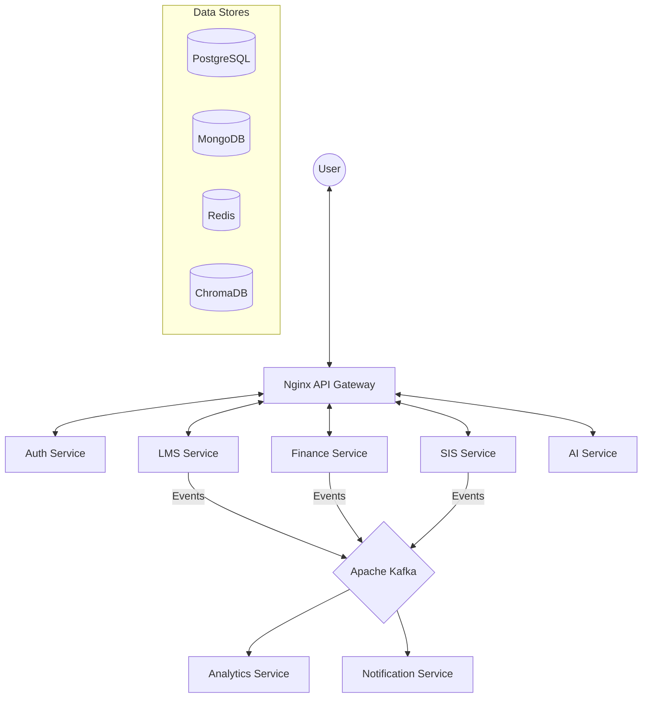

<div align="center">

# 🎓 Project Nexus
### The Unified Intelligent Campus Platform

**Final Year Design Project (FYDP) - BS Information Technology**  
**Project ID:** `FYDP-BSIT-2504`

> **Status: 100% COMPLETED** - All development, integration, and testing phases are finished.

[](docker-compose.yml)
[](backend/services)
[](frontend/README.md)
[](infrastructure/kafka/README.md)
[](infrastructure/postgres/init.sql)
[](LICENSE)

</div>

---

## 📚 Overview

**Project Nexus** is a state-of-the-art, AI-assisted university ecosystem designed to bridge the gap between academic management and operational intelligence. It is built on a **Polyglot Microservices Architecture**, integrating 14 independent services into a single, cohesive campus operating system.

The platform eliminates "data silos" and enables real-time departmental automation, providing role-specific experiences for **Students**, **Faculty**, **Administrators**, **Alumni**, and **Librarians**.

### 🌟 Core Innovation: The Intelligence Flywheel
Nexus implement a continuous feedback loop where:
1.  **Operational Data** (Biometric attendance, finance) enhances academic tracking.
2.  **Academic Engagement** (LMS activity, quiz results) informs student-risk analytics.
3.  **Assistive AI** (CAG + RAG Assistant) provides proactive guidance based on real-time database alerts.

---

## 🏗️ Architecture

Project Nexus is engineered for resilience, using an **Event-Driven Backbone** to ensure data consistency across services.



---

## 📦 Microservices

The platform is comprised of 14 specialized services, each responsible for a distinct campus domain:

| Service | Domain Responsibility | Tech Stack | Docs |
|:---|:---|:---|:---|
| **Auth** | Identity, RBAC, Bulk Resolution | FastAPI + PostgreSQL + JWT | [Read Me](backend/services/auth-service/README.md) |
| **SIS** | Departments, Programs, Enrollment | FastAPI + PostgreSQL | [Read Me](backend/services/sis-service/README.md) |
| **LMS** | Courses, Quizzes, Assignments | FastAPI + PostgreSQL + Kafka | [Read Me](backend/services/lms-service/README.md) |
| **AI Assistant** | Hybrid CAG/RAG, Degree Expert | FastAPI + Gemini + ChromaDB | [Read Me](backend/services/ai-service/README.md) |
| **Attendance** | GPS Geofence, Biometric Face Match | FastAPI + OpenCV + dlib | [Read Me](backend/services/attendance-service/README.md) |
| **Finance** | Invoices, Fines, Stripe Integration | FastAPI + PostgreSQL + Stripe | [Read Me](backend/services/finance-service/README.md) |
| **Analytics** | Predictive Scoring, KPI Dashboards | FastAPI + Scikit-learn + Mongo | [Read Me](backend/services/analytics-service/README.md) |
| **Chat** | Real-time Messaging, WebSockets | FastAPI + MongoDB + WS | [Read Me](backend/services/chat-service/README.md) |
| **Alumni** | Directory, Jobs, Mentorship, Events | FastAPI + PostgreSQL | [Read Me](backend/services/alumni-service/README.md) |
| **Operations** | Grievances, Announcements, Logs | FastAPI + MongoDB | [Read Me](backend/services/operations-service/README.md) |
| **HR** | Staff Management, Leave Workflows | FastAPI + PostgreSQL | [Read Me](backend/services/hr-service/README.md) |
| **Library** | Catalog, Circulation, Fine Linkage | FastAPI + PostgreSQL | [Read Me](backend/services/library-service/README.md) |
| **Notification**| Web Push, SMS/Email Simulation | FastAPI + MongoDB + Redis | [Read Me](backend/services/notification-service/README.md) |
| **Scheduler** | Conflict-free Timetabling Engine | FastAPI + PostgreSQL | [Read Me](backend/services/scheduler-service/README.md) |

---

## ✨ Key Features

### 🎓 Student Portal
- **Smart Dashboard**: Real-time CGPA, attendance metrics, and pending task alerts.
- **Biometric Attendance**: Secure GPS geofencing + Blink/Smile liveness detection.
- **Digital Records**: Interactive transcripts with instant PDF generation.
- **Academic AI**: 24/7 assistant that knows your degree program and alerts you of low marks.

### 👨‍🏫 Faculty Portal
- **Course Control**: Unified classroom view for assignments, quizzes, and materials.
- **Smart Grading**: Bulk review of student submissions with resolved identity mapping.
- **Attendance Insights**: Graphical attendance trends with automated warning triggers.
- **Engagement Tools**: Internal course announcements and resource sharing.

### 👔 Admin Portal
- **Command Center**: Real-time KPIs for campus-wide enrollment, revenue, and health.
- **Institution Setup**: Complete CRUD for departments, programs, and curricula.
- **Financial Ledger**: Automated fee generation, scholarship application, and ledger exports.
- **Geofence Manager**: Dynamic GPS configuration for campus security zones.

---

## 🛠️ Technology Stack

### Core Technologies
- **Frontend**: React 19, Material UI 7, Framer Motion, Recharts, Vite.
- **Backend**: FastAPI (Python 3.11), SQLAlchemy, Pydantic, HTTPX.
- **Infrastrucutre**: Docker (Compose & Swarm), Nginx (API Gateway).
- **Messaging**: Apache Kafka (Async Backbone).
- **Caching**: Redis (Session Store, Geofence Config).

### Data Intelligence
- **Relational**: PostgreSQL (Transactional Data).
- **NoSQL**: MongoDB (Event Logs, Analytics, Content).
- **Vector**: ChromaDB (AI Embeddings, Face Vectors).
- **AI/ML**: Google Gemini (LLM), Scikit-learn (Risk Prediction), OpenCV + dlib (CV).

---

## 🚀 Quick Start

### 1. Docker Deployment (Recommended) 🐳
```bash
# Clone the repository
git clone https://github.com/ASAD2204/PROJECT_NEXUS.git
cd PROJECT_NEXUS

# Start the full 14-service stack
docker-compose up -d --build
```

### 2. Access Ports
- **Application Portal**: `http://localhost:80`
- **Analytics (Grafana)**: `http://localhost:3000`
- **Metric Probes (Prometheus)**: `http://localhost:9090`

### 🔑 Demo Credentials
| Role | Email | Password |
|:---|:---|:---|
| **Admin** | `admin@nexus.edu` | `Admin@12345` |
| **Student** | `student@nexus.edu` | `Student@12345` |
| **Faculty** | `faculty@nexus.edu` | `Faculty@12345` |
| **Librarian** | `librarian@nexus.edu` | `Librarian@12345` |

---

## 👥 Project Team

| Member | Roll Number | Role | Contact |
|:---|:---|:---|:---|
| **Muhammad Asad** | BIT22031 | Project Lead & Full Stack Dev | [@ASAD2204](https://github.com/ASAD2204) |
| **Muhammad Saad** | BIT22034 | Frontend Specialist | [@saadi-js](https://github.com/saadi-js) |
| **Muhammad Hanzla** | BIT22002 | UI/UX & Documentation | [@Hanzla56-H](https://github.com/Hanzla56-H) |

**Project Supervisor:** Dr. Ghulam Mustafa  
**Project Coordinator:** Mr. Muhammad Younas  
**Institution:** IT Department, University of the Punjab, Gujranwala Campus

---

## 📜 License & Ownership

**© 2025-2026 Department of Information Technology, University of the Punjab, Gujranwala Campus**

This project is a proprietary deliverable for the **Final Year Design Project (FYDP)**. 
- All rights reserved by the University and the student developers.
- Authorized for academic evaluation and institutional review only.

<div align="center">

**Built with ❤️ for a Smarter Digital Campus**

</div>
